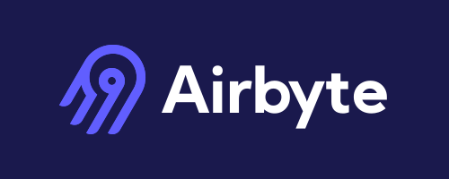

<div align="center">
  <a href="https://airbyte.ai/">
    <picture>
      <source media="(prefers-color-scheme: dark)" srcset=".github/images/logo-dark.svg">
      <source media="(prefers-color-scheme: light)" srcset=".github/images/logo-light.svg">
      
    </picture>
  </a>
</div>

<div align="center">
  <h3>A unified interface for AI agents to access data.</h3>
</div>

[](https://www.python.org/downloads/)
[](https://github.com/airbytehq/airbyte-ai-connectors/actions/workflows/publish.yml)
[](LICENSE)
[](https://github.com/airbytehq/airbyte)
[](https://slack.airbyte.com/)
[](https://twitter.com/airbytehq)

# Airbyte AI Connectors

Airbyte AI Connectors are packages that let AI agents call third‑party APIs through strongly typed, well‑documented tools. Each connector is a standalone Python package that you can use directly in your app, plug into an agent framework, or expose through MCP (coming soon) and APIs(coming soon).

## What this repo contains
* Python SDKs for specific SaaS APIs (for example Gong, Stripe, GitHub). 
* A consistent connector layout so you can understand and extend any connector quickly. 
* Ready‑to-use clients that validate auth, handle schemas, and expose typed methods for each operation.

## Quickstart with the Python SDK
The Python SDK exposes Airbyte AI Connectors as native Python clients. These can run standalone or be attached as tools inside frameworks like PydanticAI or LangChain. To get started, add the connector package to your dependencies or `pyproject.toml`. For this installation, we will use Gong as an example:

```yaml
dependencies = [
    "pydantic-ai>=0.0.1",
    "airbyte-ai-gong",
]
```

Next, import the generated connector class for the integration you plan to use. Provide the necessary API credentials or secrets required by the third-party integration. Airbyte AI Connectors validate these, then expose typed methods for all operations:

```py
from airbyte_ai_gong import GongConnector
from airbyte_ai_gong.models import GongAuthConfig

connector = GongConnector.create(auth_config=GongAuthConfig(
    access_key="...",
    access_key_secret="...",
))
```

Once this is done, you may attach connector calls as tools so your agent can call them during reasoning or tool execution. See the following example using a PydanticAI Agent:

```py
import os
from pydantic_ai import Agent
from airbyte_ai_gong import GongConnector
from airbyte_ai_gong.models import GongAuthConfig

connector = GongConnector(auth_config=GongAuthConfig(
    access_key=os.environ["GONG_ACCESS_KEY"],
    access_key_secret=os.environ["GONG_ACCESS_KEY_SECRET"],
))

agent = Agent(
    "openai:gpt-4o",
    system_prompt=(
        "You manage Gong calls and transcripts. "
        "You can list users, get user details, list calls, and fetch call details. "
        "Execute actions immediately."
    ),
)

@agent.tool_plain
async def list_users(limit: int = 10):
    return await connector.users.list(limit=limit)

@agent.tool_plain
async def get_user(user_id: str):
    return await connector.users.get(id=user_id)
```

You can see a detailed list of supported entities and methods for each connector by navigating to its [available operations](https://github.com/airbytehq/airbyte-ai-connectors/tree/main/connectors/gong#available-operations).

## Connector Structure
Each connector is a standalone Python package:

```
connectors/
├── gong/
│   ├── airbyte_ai_gong/
│   ├── pyproject.toml
│   ├── CHANGELOG.md
│   └── README.md
├── github/
│   └── ...
└── ...
```
Inside each connector folder, you’ll find:
* Generated Python client
* Connector-specific README with supported operations
* Typed methods generated from Airbyte’s connector definitions
* Validation + error handling

## When to use these connectors
Use Airbyte AI Connectors when you want:
* Agent‑friendly data access: Let LLM agents call real SaaS APIs (e.g., CRM, billing, analytics) with guardrails and typed responses. 
* Consistent auth and schemas: Reuse a uniform configuration and error‑handling pattern across many APIs. Use connectors inside frameworks like PydanticAI, LangChain, or any custom agent loop
* Composable building blocks: Combine multiple connectors in a single agent to orchestrate multi‑system workflows. 
Compared to building ad‑hoc API wrappers, these connectors give you a shared structure, generated clients, and alignment with the rest of the Airbyte ecosystem.

## Roadmap
We are actively expanding AI Connectors. Coming soon:
* MCP support (Model Context Protocol)
* Hosted API Gateway for managed tool execution
* Demo apps + starter templates
* More connectors added weekly

## Contributing / Feedback
We actively welcome feedback, ideas, and bug reports. 
If you're building AI agents with Airbyte AI Connectors and want to share ideas or get help, join our community on [slack](https://airbytehq.slack.com/ssb/redirect#/shared-invite/email). We’d love to hear what you're building and what connectors or capabilities you’d like to see next.


Brought to you with love by Airbyte 💜